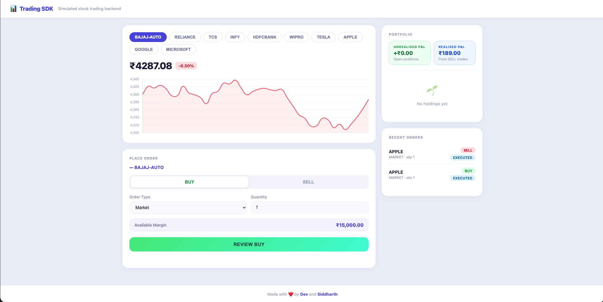

# 📈 Trading SDK

> A simulated stock trading backend that mimics core broker functionalities — instrument listing, order placement, trade execution, and portfolio tracking — with a clean dashboard UI.


🌐 **Live Demo:** [https://trading-sdk.onrender.com](https://trading-sdk.onrender.com)

> ⚠️ Hosted on Render free tier — first request after inactivity may take ~50 seconds.

---



---

## ✨ Features

- Browse 10 tradable instruments (NSE + NASDAQ)
- Place BUY / SELL orders (MARKET & LIMIT)
- Track order status with pagination
- View executed trades
- Portfolio holdings with Unrealised & Realised P&L
- Interactive price chart per stock
- In-memory data storage

## 🛠 Tech Stack

| Layer | Technology |
|-------|-----------|
| Backend | Python, FastAPI, Uvicorn |
| Validation | Pydantic |
| Frontend | HTML, CSS, Vanilla JS |
| Hosting | Render |

## 🚀 Setup (Local)

**1. Install dependencies**
```bash
pip install fastapi uvicorn pydantic
```

**2. Run the server**
```bash
uvicorn app.main:app --reload
```

**3. Open in browser**
http://127.0.0.1:8000

text

## 📡 API Endpoints

| Method | Endpoint | Description |
|--------|----------|-------------|
| `GET` | `/api/v1/instruments` | List all stocks |
| `POST` | `/api/v1/orders` | Place an order |
| `GET` | `/api/v1/orders` | Get all orders |
| `GET` | `/api/v1/orders/{orderId}` | Get order by ID |
| `GET` | `/api/v1/trades` | View all trades |
| `GET` | `/api/v1/portfolio` | View holdings |

## 📝 Assumptions

- Single hardcoded user
- Market orders execute immediately
- No real market connectivity
- In-memory storage — resets on restart

---

<p align="center">Made with ❤️ by <a href="https://www.instagram.com/dev7kalra/">Dev</a> and <a href="https://www.instagram.com/siddharthh_959/">Siddharth</a></p>